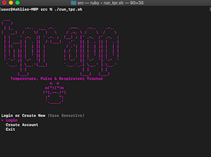
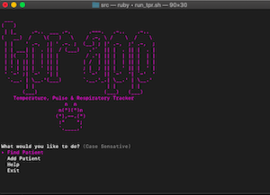
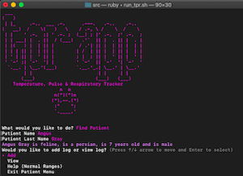
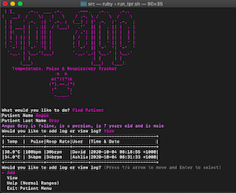
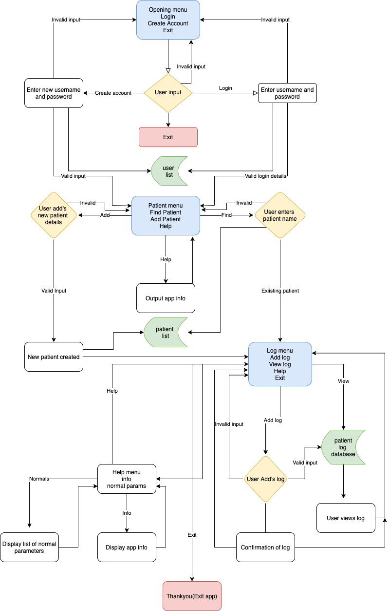

# T.P.R Tracker - T1A3
## Purpose
Welcome to the TPR (Temperature, pulse and respiratory) tracker. This app is designed to easily track the temperature, pulse and respiratory rate of inpatients in a veterinary hospital.
The app allows for each nurse and vet in the hospital to enter their account details or create a new account and accurately log the temperature, pulse and respiration rate of the inpatients in their care. Once in their account, the vet or nurse will have the ability to add a new patient or view the log of an existing patient. Any staff member with an account will be able to read the log for any inpatient and add a new one. Once the information has been logged, the nurse or vet can log out of their account. Each entry that the vet or nurse has made will be time stamped and their username will be attached to comply with veterinary industry record keeping protocols.

## Software Development
I have developed this app for veterinarians and veterinary nurses, to have the ability to create a digital record and process of logging and viewing patient details. The current problem in most hospitals is that paper records can easily be misplaced, swapped or changed. While the animal still needs to be identified by a cage card, this will solve the problem and also save the use of paper and time scanning/uploading documents to a patients file . It will also make the log easily accessible to the target audience of vets or nurses who aren't in the hospital area, but would like to access the records from their consultation room.

### Features
- User Login/Creation Feature : Allows a vet or nurse to login or out of their account so that accurate records can be kept. This feature also allows a user to create an account with a username and password. If they do not make an account or use their existing one, they wont be able to log or access the information.
- Patient Profile Search/Profile Creation Feature: Allows the vet or nurse to find current inpatients and view the file. This feature also allows the user to create a new patient file as they are admitted to hospital.
- TPR Log and View Feature: Allows the user to easily log the temperature, pulse and respiration rate of the patient they are examining. The data can then be viewed instantly presented in table format.
- Navigation Menu's: Allows the user to easily navigate through the app. Customized help menus are also featured depending on which menu you are in. The main menu gives general user tips, and the patient menu provides a table of normal TPR values for common species.


### Installation
The app can be accessed from GitHub, please click https://github.com/Ashlie-G/T1A3_2
Download all files as a zip and unpack files on your computer

From the command line navigate to the root folder(T1A3_2-master).
Once you are in the T1A3_2-master folder run in the command line 

``` cd T1A3_2-master/Documents/AshlieGray_T1A3/src``` 

Once in the src folder, if you do not already have the gem requirements (listed below), please run the following script:

```./gem_install.sh```

Once this process is complete or if you already have the required gems installed, from the 'src' folder run the following script to launch the app:

```./run_tpr.sh```

Please create a user file, follow the input prompts and track your patients temperature, pulse and respiratory rate.

**Gem Requirements**
Please do not use the following command line inserts if you have already ran the gem install script above.
 - TTY Prompt

 ```gem install tty-prompt```

 - TTY Table

 ```gem install tty-table```

 - Colorize

 ```gem install-colorize```


**System Requirements**
Mac OS
Ruby >= 0.8.1
If ruby is not already installed on your computer, please go to https://www.ruby-lang.org/en/downloads/ 

**App Requirements**
- User account will need to be made in order to attach identity to each record.
- Details for patient you would like to enter into the app (first and last name, species, breed, age, sex).

### User Interaction

Veterinarians and veterinary nurses will use this in order to save time, log accurate patient information and have this information accessible to everyone with an account. First the user will log in or create an account. During a round, they will approach the animals kennel, confirm the identification of the animal and either navigate to its file or create one. They then perform their check of vital signs, navigate to the patient menu and log it in to the animals file. They can then view the log or exit that animals file (assuming everything is within normal range) and repeat the process with the next patient. As rounds happen frequently, the log will contain the identity of the vet or nurse who logged it, the time and date. Each patient's file will be amended with each entry so there is a complete picture of its progress throughout it's hospital stay. This is then automatically attached to the animals digital records.



The app will need the user to log in or create an account. The user is presented with a scrolling opening menu as follows:
Welcome to the TPR Tracker
"Login"
"Create Account"
"Exit"
This will loop until they log in, create an account or decide to exit the app. To login, they enter a username and password. To create an account they create a username and password. 'Exit' will present a 'thank you' message and exit the app.



Once the user has logged in the with correct details or created an account, they will be presented with a prompt "What would you like to do?" followed by a list of the main menu options to scroll through:
"Find Patient"
"Add Patient"
"Help"
"Exit"
If they select "Find Patient", they will be able to type the patients first and last name. If the user wants to add a patient, they will be prompted to enter the required information. The help option displays information on how to navigate or cancel the current session and the exit takes the user back to the opening menu. 



If the user selects find or adds a patient and the details entered are correct, the user will be presented with the patient menu options:
"Add"
"View"
"Help - Normal Values"
"Exit" 
If the user selects add log, they will be prompted to add the patients temperature, pulse rate and respiratory rate. They will then loop back to the menu where they can either view the log or repeat the process for the next patient.



If they select 'view log' the animals monitoring record will print to the screen in a table. 
If the user is unsure of a value they have inputted, they can select the help menu which will present a table of the normal values for dogs, cats and guinea pigs.
When the user has finished, they can exit this menu, which loops back to the main, where they can log out of the app.

### Error Handling

As this app is largely based on user input, this leaves room for errors.
All input is required, nothing can be left empty. The user is presented with a 'value required' message if no input is received.
If incorrect data types are entered, for example when the app is expecting numbers, like in the log feature, an error message will appear stating that the value entered cannot be converted, so number will need to be inputted to move forward.
In terms of authentication, users are presented with error messages if usernames, passwords or patient names are incorrect, and are direct back to the appropriate menu, or prompted to re-run the program.
If the database files (Csv) are empty, the user will be notified and prompted to create either a user or patient profile.

### Help
While using the TPR Tracker, a user may exit the app at any time by pressing Control + c, then input the following command line prompt:

```ruby main.rb -h```

to get help at any point.
Installation instructions as above.
Help menu options are available within the app. Navigation help is featured in the main menu and normal species parameter value help is in the patient menu.
If the user or patient databases get deleted (Users.csv, Patients.csv), the user needs to create a new account or new patient, and a new database will automatically generate.
Please ensure that the first line of the Users.csv file is ```username,password``` (no spaces), and the first line of the Patients.csv is ```first_name,last_name,species,breed,age,sex```(no spaces).

### Control Flow


### Github Repository & Trello Board
https://github.com/Ashlie-G/T1A3_2
https://trello.com/b/t89yNIU2/tprp-monitor


### References
1. TTY-Prompt 2020, Piotr Murach, TTY- Toolkit, viewed 24th September 2020, <https://github.com/piotrmurach/tty-prompt>
2. TTY-Table 2020, Piotr Murach, TTY-Toolkit, viewed 24th September 2020, <https://github.com/piotrmurach/tty-table>
3. Colorize 2018, Michał Kalbarczyk, viewed 24th September 2020, <https://github.com/fazibear/colorize>
4. Ascii.co.uk 2020, 'Ascii paws', viewed September 28th 2020 from <https://ascii.co.uk/art/pawprints>
5. Patorjk.com 2020, 'Ascii Font Generator', vewied 28th September 2020 from <http://patorjk.com/software/taag/#p=display&      f=Graffiti&t=Type%20Something%20>
6. Woof Resources 2020, 'Normal Ranges of Small Animals Parameters', viewed 29th Septmber 2020 from <https://www.woofresources.com.au/free-resources>


